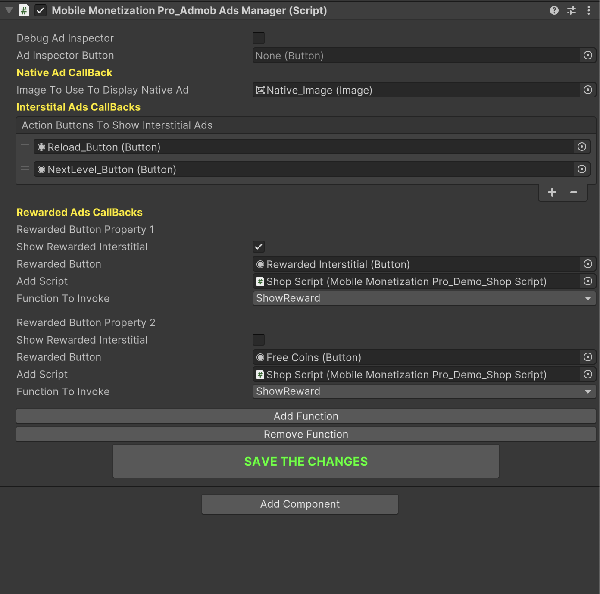

# Admob Ads Mediation Part-2

    <iframe width="700" height="405" src="https://www.youtube.com/embed/Lb2_CzAKLuc" title="YouTube video player" frameborder="0" allow="accelerometer; autoplay; clipboard-write; encrypted-media; gyroscope; picture-in-picture; web-share" referrerpolicy="strict-origin-when-cross-origin" allowfullscreen></iframe>

## Introduction

In this video, we will be integrating **Admob Ads Mediation** into your mobile game using **Mobile Monetization Pro**.

You'll learn how to:

- Set up your Admob account for Mediation.

- Configure Admob SDK in Unity.

- Integrate and test ads.

### Admob Ads Initializer 

<table class="custom-table">
<tr>
  <th>Fields</th>
  <th>Info</th>
</tr>
<tr><td>UseGDPRConsent</td><td>Enable or disable GDPR consent support.</td></tr>
<tr><td>AndroidBannerId</td><td>Android AdMob Banner Ad Unit ID.</td></tr>
<tr><td>AndroidInterstitalId</td><td>Android AdMob Interstitial Ad Unit ID.</td></tr>
<tr><td>AndroidRewardedId</td><td>Android AdMob Rewarded Video Ad Unit ID.</td></tr>
<tr><td>AndroidNativeId</td><td>Android AdMob Native Ad Unit ID.</td></tr>
<tr><td>AndroidAppOpenId</td><td>Android AdMob App Open Ad Unit ID.</td></tr>
<tr><td>AndroidRewardedInterstitialID</td><td>Android AdMob Rewarded Interstitial Ad Unit ID.</td></tr>
<tr><td>IOSBannerId</td><td>iOS AdMob Banner Ad Unit ID.</td></tr>
<tr><td>IOSInterstitalId</td><td>iOS AdMob Interstitial Ad Unit ID.</td></tr>
<tr><td>IOSRewardedId</td><td>iOS AdMob Rewarded Video Ad Unit ID.</td></tr>
<tr><td>IOSNativeId</td><td>iOS AdMob Native Ad Unit ID.</td></tr>
<tr><td>IOSAppOpenId</td><td>iOS AdMob App Open Ad Unit ID.</td></tr>
<tr><td>IOSRewardedInterstitialID</td><td>iOS AdMob Rewarded Interstitial Ad Unit ID.</td></tr>
<tr><td>ShowBannerAdsInStart</td><td>Automatically show banner ads when the game starts.</td></tr>
<tr><td>ChooseBannerPosition</td><td>Choose where the banner ad should be displayed.</td></tr>
<tr><td>UseAdaptiveBannerSize</td><td>Enable support for adaptive banners based on screen orientation.</td></tr>
<tr><td>UseCustomAdaptiveBannerWidth</td><td>Enable to manually set the width for adaptive banners.</td></tr>
<tr><td>CustomAdaptiveBannerWidth</td><td>Specify a custom width for adaptive banners (only used if UseCustomAdaptiveBannerWidth is true).</td></tr>
<tr><td>AdaptiveBannerAdSizeOptions</td><td>Select which screen orientations to support for adaptive banners.</td></tr>
<tr><td>BannerAdSize</td><td>Set the standard banner ad size if adaptive is not used.</td></tr>
<tr><td>EnableTimedInterstitalAds</td><td>Enable to automatically show interstitial ads after a time interval.</td></tr>
<tr><td>InterstitialAdIntervalSeconds</td><td>Time interval (in seconds) to wait before showing an interstitial ad again.</td></tr>
<tr><td>ResetInterstitalAdTimerOnRewardedAd</td><td>Reset interstitial ad timer after showing a interstitial ad.</td></tr>
<tr><td>AppOpensToCheckBeforeShowingAppOpenAd</td><td>Number of app opens to check before showing an AppOpen Ad.</td></tr>
<tr><td>DelayShowAppOpenAd</td><td>Delay in seconds before showing an AppOpen Ad after the game starts.</td></tr>
</table>

### Admob Ads Manager 

<table class="custom-table">
<tr>
  <th>Fields</th>
  <th>Info</th>
</tr>
<tr><td>DebugAdInspector</td><td>Enable or disable the debugging of Ad Inspector.</td></tr>
<tr><td>AdInspectorButton</td><td>Button to open Ad Inspector for debugging.</td></tr>
<tr><td>ShowBannerAdButton</td><td>Button to show the banner ad.</td></tr>
<tr><td>ImageToUseToDisplayNativeAd</td><td>Image used to display the native ad.</td></tr>
<tr><td>ShowRewardedInterstial</td><td>If true, shows a rewarded interstitial ad.</td></tr>
<tr><td>RewardedButton</td><td>Button associated with the rewarded ad.</td></tr>
<tr><td>script</td><td>Script attached to the button that will call the selected function.</td></tr>
<tr><td>scriptName</td><td>Name of the script associated with the button.</td></tr>
<tr><td>functionNames</td><td>List of function names to call from the script.</td></tr>
<tr><td>selectedFunctionIndex</td><td>Index of the selected function from the list.</td></tr>
<tr><td>ActionButtonsToInvokeInterstitalAds</td><td>Buttons that trigger the interstitial ads.</td></tr>
<tr><td>rewardedButtons</td><td>List of buttons that will trigger rewarded ads.</td></tr>
</table>