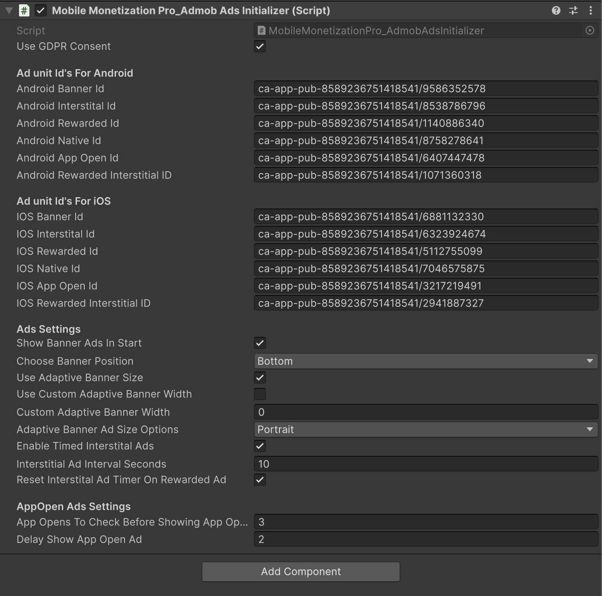

# <span font-weight:bold;">Admob Ads Callbacks Part-3</span>

<div class="video-container">
    <iframe width="700" height="405" src="https://www.youtube.com/embed/wT1crYaJsCY" title="YouTube video player" frameborder="0" allow="accelerometer; autoplay; clipboard-write; encrypted-media; gyroscope; picture-in-picture; web-share" referrerpolicy="strict-origin-when-cross-origin" allowfullscreen></iframe>
</div>

## Introduction

In this video, we will learn how to set up **AdMob Ads Callbacks** in your mobile game using **Mobile Monetization Pro**.

### Admob Ads - Banner & Interstitial Callback Event Example



```csharp
using System.Collections;
using UnityEngine;

public class AdmobAdEvents : MonoBehaviour
{
    private MobileMonetizationPro.MobileMonetizationPro_AdmobAdsInitializer admobInitializer;

    private void Start()
    {
        admobInitializer = MobileMonetizationPro.MobileMonetizationPro_AdmobAdsInitializer.instance;
        if (admobInitializer != null)
        {
            StartCoroutine(ShowInterstitialAutomatically());
        }
        else
        {
            Debug.LogWarning("AdmobAdsInitializer instance not found!");
        }
    }

    private void OnTriggerEnter(Collider other)
    {
        if (other.CompareTag("Player") && admobInitializer != null)
        {
            admobInitializer.HideBanner();
        }
    }

    private void OnTriggerExit(Collider other)
    {
        if (other.CompareTag("Player") && admobInitializer != null)
        {
            admobInitializer.ShowBanner();
        }
    }

    private IEnumerator ShowInterstitialAutomatically()
    {
        yield return new WaitForSeconds(5f);
        if (admobInitializer != null)
        {
            admobInitializer.ShowInterstitialAd(true);
            admobInitializer.ResetInterstitialAdTimer();
        }
    }
}
```

### Admob Ads - Rewarded Callback Event Example  

```csharp
using UnityEngine;
using UnityEngine.SceneManagement;
using UnityEngine.UI;

public class ProgressionBar : MonoBehaviour
{
    public Image fillImage;  // Image component to fill
    public float fillSpeed = 0.1f;  // Speed at which the fill completes

    public Button LoadLevelButton;

    private void Start()
    {
        if (fillImage == null)
        {
            Debug.LogError("Fill Image is not assigned!");
            return;  // Exit if no image assigned
        }

        fillImage.fillAmount = 0f; // Ensure starting from 0
        StartFilling(); // Start filling normally if assigned
    } 
    private void Update()
    {
        if(MobileMonetizationPro.MobileMonetizationPro_AdmobAdsInitializer.instance.IsRewardedAdCompleted == true)
        {
           // give reward
           LoadLevelButton.gameObject.SetActive(true);
           MobileMonetizationPro.MobileMonetizationPro_AdmobAdsInitializer.instance.IsRewardedAdCompleted = false;
        }
    }
    public void StartFilling()
    {
        StartCoroutine(FillProgressionBar());
    }

    private System.Collections.IEnumerator FillProgressionBar()
    {
        while (fillImage.fillAmount < 1f)
        {
            fillImage.fillAmount += fillSpeed * Time.deltaTime;  // Increment fill amount based on time
            fillImage.fillAmount = Mathf.Clamp01(fillImage.fillAmount); // Clamp to make sure it doesn't overshoot
            yield return null;  // Wait for next frame
        }

        // Fill completed
        Debug.Log("Fill Completed!");

       
         if (MobileMonetizationPro.MobileMonetizationPro_AdmobAdsInitializer.instance != null)
           MobileMonetizationPro.MobileMonetizationPro_AdmobAdsInitializer.instance.ShowRewardedAd();
    }
}

```

