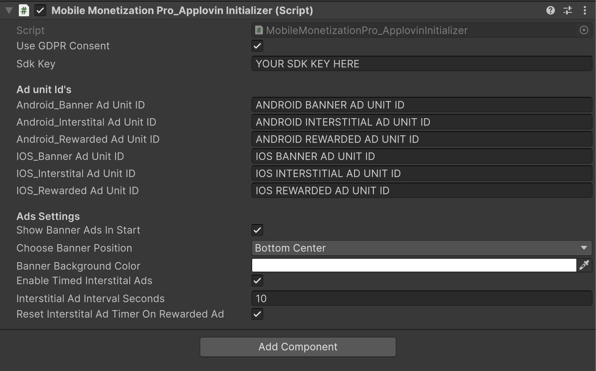
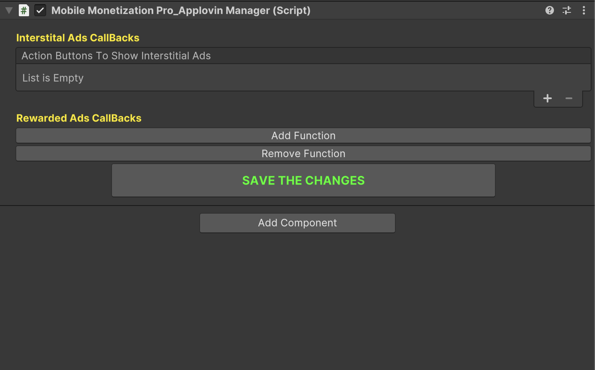

# Applovin Ads Part-1

    <iframe width="700" height="405" src="https://www.youtube.com/embed/axE92MwLIdg" title="YouTube video player" frameborder="0" allow="accelerometer; autoplay; clipboard-write; encrypted-media; gyroscope; picture-in-picture; web-share" referrerpolicy="strict-origin-when-cross-origin" allowfullscreen></iframe>

## Introduction

In this video, we take the first step in integrating **Applovin Ads** into your mobile game using **Mobile Monetization Pro**.

You'll learn how to:

- Set up your Applovin account.

- Configure Applovin SDK in Unity.

- Integrate and test applovin ads.

### Applovin Ads Initializer 

<table class="custom-table">
<tr>
<th>Fields</th>
<th>Info</th>
</tr>

<tr>
<td>UseGDPRConsent</td>
<td>If enabled, the SDK will wait for GDPR consent before initializing ads.</td>
</tr>

<tr>
<td>SdkKey</td>
<td>Your AppLovin MAX SDK Key. Required to initialize the SDK.</td>
</tr>

<tr>
<td>Android_BannerAdUnitID</td>
<td>Banner Ad Unit ID for Android.</td>
</tr>

<tr>
<td>Android_InterstitalAdUnitID</td>
<td>Interstitial Ad Unit ID for Android.</td>
</tr>

<tr>
<td>Android_RewardedAdUnitID</td>
<td>Rewarded Ad Unit ID for Android.</td>
</tr>

<tr>
<td>IOS_BannerAdUnitID</td>
<td>Banner Ad Unit ID for iOS.</td>
</tr>

<tr>
<td>IOS_InterstitalAdUnitID</td>
<td>Interstitial Ad Unit ID for iOS.</td>
</tr>

<tr>
<td>IOS_RewardedAdUnitID</td>
<td>Rewarded Ad Unit ID for iOS.</td>
</tr>

<tr>
<td>ShowBannerAdsInStart</td>
<td>If enabled, banner ads will be shown automatically at the start.</td>
</tr>

<tr>
<td>ChooseBannerPosition</td>
<td>Position on the screen where the banner ad will be displayed.</td>
</tr>

<tr>
<td>BannerBackgroundColor</td>
<td>Background color for the banner ad.</td>
</tr>

<tr>
<td>EnableTimedInterstitalAds</td>
<td>If enabled, interstitial ads will be shown automatically after a timed interval.</td>
</tr>

<tr>
<td>InterstitialAdIntervalSeconds</td>
<td>Time interval (in seconds) after which an interstitial ad will be shown.</td>
</tr>

<tr>
<td>ResetInterstitalAdTimerOnRewardedAd</td>
<td>If enabled, the interstitial ad timer will reset after showing a rewarded ad.</td>
</tr>

</table>

### Applovin Ads Manager 

<table class="custom-table">
<tr>
<th>Fields</th>
<th>Info</th>
</tr>

<tr>
<td>ShowBannerAdButton</td>
<td>Button that shows the banner ad when clicked.</td>
</tr>

<tr>
<td>FunctionInfo.RewardedButton</td>
<td>Button that triggers a rewarded ad and invokes a function when the ad is completed.</td>
</tr>

<tr>
<td>FunctionInfo.script</td>
<td>Script containing the function to invoke after ad completion.</td>
</tr>

<tr>
<td>FunctionInfo.scriptName</td>
<td>Name of the selected script.</td>
</tr>

<tr>
<td>FunctionInfo.functionNames</td>
<td>List of function names available in the selected script.</td>
</tr>

<tr>
<td>FunctionInfo.selectedFunctionIndex</td>
<td>Index of the function selected to be called from the list.</td>
</tr>

<tr>
<td>ActionButtonsToInvokeInterstitalAds</td>
<td>Buttons that trigger an interstitial ad when clicked.</td>
</tr>

<tr>
<td>rewardedButtons</td>
<td>Auto-generated list of rewarded buttons associated with functions.</td>
</tr>

</table>
