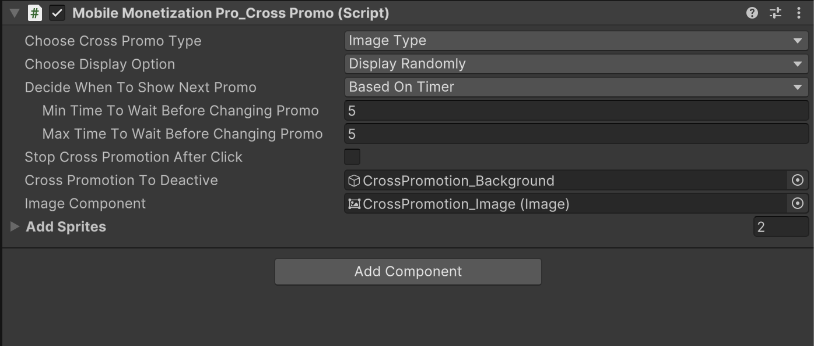
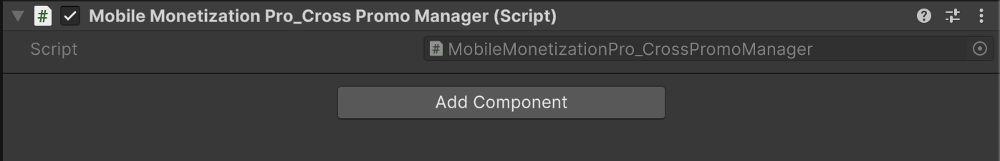

# Cross-Promotion

    <iframe width="700" height="405" src="https://www.youtube.com/embed/62XRin_aEsQ" title="YouTube video player" frameborder="0" allow="accelerometer; autoplay; clipboard-write; encrypted-media; gyroscope; picture-in-picture; web-share" referrerpolicy="strict-origin-when-cross-origin" allowfullscreen></iframe>

## Introduction

The tutorial focuses on implementing **Cross-Promotion** within a game, providing step-by-step instructions on how to set it up.

### Cross-Promo Script

<table class="custom-table">
<tr>
<th>Fields</th>
<th>Info</th>
</tr>

<tr>
<td><b>ChooseCrossPromoType</b></td>
<td>Select the type of cross-promotion to display.</td>
</tr>

<tr>
<td><b>videoPlayer</b></td>
<td>Video player component used to play video cross-promotions.</td>
</tr>

<tr>
<td><b>ChooseDisplayOption</b></td>
<td>Choose how to display the sprites.</td>
</tr>

<tr>
<td><b>RawImageComponent</b></td>
<td>RawImage component for displaying video or image.</td>
</tr>

<tr>
<td><b>RenderTextureComponent</b></td>
<td>Render texture component for the video player.</td>
</tr>

<tr>
<td><b>ImageComponent</b></td>
<td>Image component for displaying image cross-promotions.</td>
</tr>

<tr>
<td><b>AddVideos</b></td>
<td>List of video cross-promotions to display.</td>
</tr>

<tr>
<td><b>AddSprites</b></td>
<td>List of image cross-promotions to display.</td>
</tr>

<tr>
<td><b>DecideWhenToShowNextPromo</b></td>
<td>Determine when the next promo should be displayed.</td>
</tr>

<tr>
<td><b>NoOfAppOpensToCheckBeforeNewPromo</b></td>
<td>Number of app opens to check before showing a new cross-promotion.</td>
</tr>

<tr>
<td><b>NoOfSessionsToCheckBeforeNewPromo</b></td>
<td>Number of sessions to check before showing a new cross-promotion.</td>
</tr>

<tr>
<td><b>MinTimeToWaitBeforeChangingPromo</b></td>
<td>Minimum time (in seconds) to wait before changing the cross-promotion.</td>
</tr>

<tr>
<td><b>MaxTimeToWaitBeforeChangingPromo</b></td>
<td>Maximum time (in seconds) to wait before changing the cross-promotion.</td>
</tr>

<tr>
<td><b>StopCrossPromotionAfterClick</b></td>
<td>If true, stop cross-promotion after the user clicks.</td>
</tr>

<tr>
<td><b>CrossPromotionToDeactive</b></td>
<td>GameObject to deactivate when cross-promotion ends.</td>
</tr>

</table>

### Cross-Promo Manager Script

