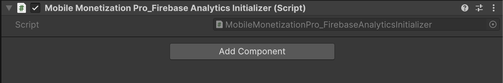

# Firebase Analytics

    <iframe width="700" height="405" src="https://www.youtube.com/embed/NtDOVpyCous" title="YouTube video player" frameborder="0" allow="accelerometer; autoplay; clipboard-write; encrypted-media; gyroscope; picture-in-picture; web-share" referrerpolicy="strict-origin-when-cross-origin" allowfullscreen></iframe>

## Introduction

The tutorial focuses on integrating **Firebase Analytics** into a Unity project.

### Creating a Firebase Project

- Users need to create a new Firebase project by clicking on the "Add Project" option.
- As an example - project is named "Size Shift", and users are instructed to enable Google Analytics for the project before proceeding.
- After selecting their Google account, users complete the project creation process by clicking "Create Project" and then "Continue".

### Registering the Unity App

- Next, users must register their Unity application as an Unity Android app within the Firebase console.
- To do this, they need to enter the package name from their Unity project settings and provide an app nickname, which is example - "Size Shift".
- Once registered, users are prompted to download the Google services JSON file, which must be correctly placed in their Unity project directory.

### Downloading and Installing Firebase SDK

- Users are instructed to download the Firebase Unity SDK and extract the contents of the zip file.
- After extraction, the Firebase Analytics Unity package should be imported into the Unity project by dragging and dropping it into the project window.

### Configuring Firebase in Unity

- Within Unity, users must navigate to the Tools menu and select the Mobile Monetization Pro integration tool to choose Firebase Analytics.
- After confirming that the Firebase SDK is installed, users need to click on "Import Required Scripts" and close the integration window.
- They need to create an empty game object named "Firebase Analytics" and drag the Firebase initializer script into it.

###  Resolving Errors During Integration

- Upon entering play mode, users may encounter an error indicating that the Firebase CPP bundle cannot be opened due to verification issues.
- To resolve this, users need to adjust their system settings by navigating to Security and allowing the Firebase CPP app [As shown in the video above].
- After allowing the app, users can exit play mode, clear the console, and re-enter play mode to verify successful integration.

### Firebase Analytics Initializer Script

