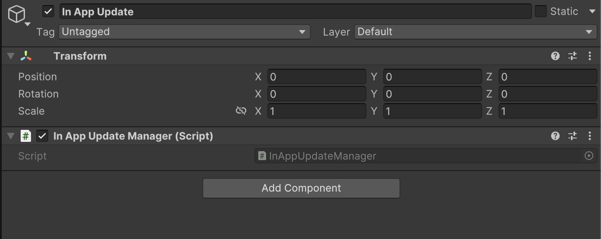

# In App Update

    <iframe width="700" height="405" src="https://www.youtube.com/embed/BcNSoyewl0g" title="YouTube video player" frameborder="0" allow="accelerometer; autoplay; clipboard-write; encrypted-media; gyroscope; picture-in-picture; web-share" referrerpolicy="strict-origin-when-cross-origin" allowfullscreen></iframe>

## Introduction

The video begins with an overview of the process of integrating **In-App updates** for Android applications.

### Downloading the Unity Package

- The first step involves navigating to the tools section within the mobile monetization pro integration tool.
- Users are instructed to select the in-app update integration option and to download the latest Android in-app update Unity package.
- After downloading, the package must be installed in the Unity project.

### Importing Required Packages

- Once the Unity package is installed, the next step is to import required scripts into the project.
- If the external dependency manager is already present, users can skip its installation and proceed to import the Google Play plugins along with the in-app update.

### Setting Up the In-App Update Manager

- The next step involves creating an empty game object, named in-app update, within the Unity hierarchy.
- Users should reset the transform of this game object and then drag and drop the in-app update manager script onto it.
- After setting up the manager script, the project is ready for testing on a real Android device.

### Configuring Project Settings

- Before testing, it is essential to configure the project settings, specifically the version and bundle version code.
- Users are advised to ensure that the package name and game name are correctly set before proceeding to the Google Play Console.

### Creating a Release in Google Play Console

- The video guides users to access the Google Play dashboard where a test environment has already been prepared.
- Users should create a new release and uploading the new bundle.

### Testing the In-App Update

- To test the in-app update functionality, a new version of the game must be uploaded to the Google Play Console.
- The version number should be updated, and release notes should be added for clarity before publishing.
- Once published, users can begin testing the update feature by opening the game and observing the update notification.

### In App Update Script

