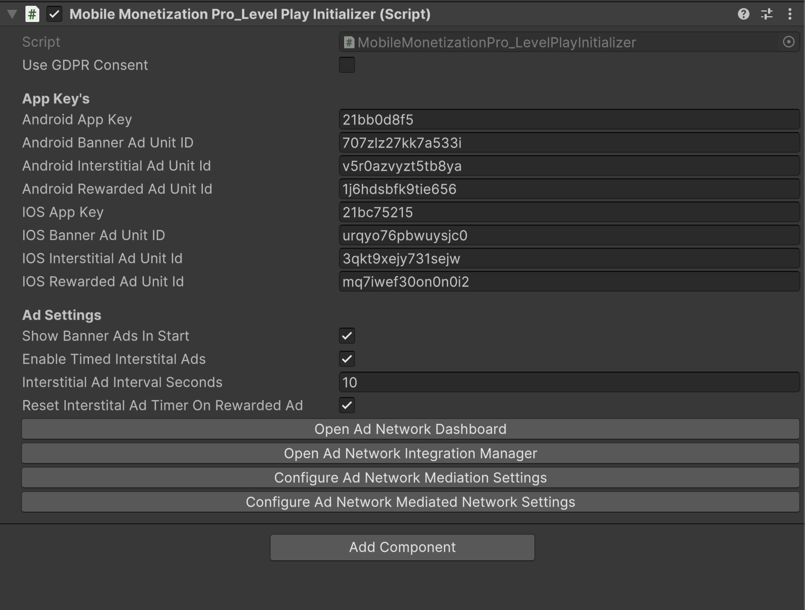
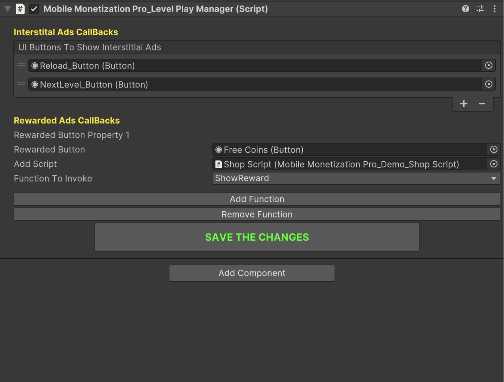

# LevelPlay Ads Setup Part-1

    <iframe width="700" height="405" src="https://www.youtube.com/embed/UkX2b65P1Lo" title="YouTube video player" frameborder="0" allow="accelerometer; autoplay; clipboard-write; encrypted-media; gyroscope; picture-in-picture; web-share" referrerpolicy="strict-origin-when-cross-origin" allowfullscreen></iframe>

## Introduction

In this video, you'll learn how to integrate **LevelPlay** ads into your Unity mobile game. We will cover the following key concepts:

- **Setting up LevelPlay**: Learn how to create an account and set up your project in LevelPlay.
- **Integrating LevelPlay SDK**: A step-by-step guide on adding the LevelPlay SDK to your Unity project.
- **Ad formats**: Understand the different types of ads available (banner ads, interstitials, rewarded videos) and how to implement each one.
- **Testing on android and iOS**: We will test the game on both Android and iOS device.

By the end of the video, you'll have a fully functional ad setup in your game.

### LevelPlay Ads Initializer 

<table class="custom-table">
<tr>
  <th>Fields</th>
  <th>Info</th>
</tr>
<tr><td>UseGDPRConsent</td><td>Flag to indicate whether to use GDPR consent before loading ads.</td></tr>
<tr><td>AndroidAppKey</td><td>The app key for the Android platform.</td></tr>
<tr><td>AndroidBannerAdUnitID</td><td>The ad unit ID for displaying banner ads on Android.</td></tr>
<tr><td>AndroidInterstitialAdUnitId</td><td>The ad unit ID for displaying interstitial ads on Android.</td></tr>
<tr><td>AndroidRewardedAdUnitId</td><td>The ad unit ID for displaying rewarded ads on Android.</td></tr>
<tr><td>iOSAppKey</td><td>The app key for the iOS platform.</td></tr>
<tr><td>iOSBannerAdUnitID</td><td>The ad unit ID for displaying banner ads on iOS.</td></tr>
<tr><td>iOSInterstitialAdUnitId</td><td>The ad unit ID for displaying interstitial ads on iOS.</td></tr>
<tr><td>iOSRewardedAdUnitId</td><td>The ad unit ID for displaying rewarded ads on iOS.</td></tr>
<tr><td>ShowBannerAdsInStart</td><td>Flag to indicate whether to show banner ads at the start of the game.</td></tr>
<tr><td>EnableTimedInterstitalAds</td><td>Flag to indicate whether interstitial ads should be shown after a time interval.</td></tr>
<tr><td>InterstitialAdIntervalSeconds</td><td>The interval duration in seconds to wait before showing a timed interstitial ad.</td></tr>
<tr><td>ResetInterstitalAdTimerOnRewardedAd</td><td>Flag to indicate whether the interstitial ad timer should be reset when a rewarded ad is shown.</td></tr>
</table>

### LevelPlay Ads Manager 

<table class="custom-table">
<tr>
  <th>Fields</th>
  <th>Info</th>
</tr>
<tr><td>ShowBannerAdButton</td><td>Button to show banner ad when clicked.</td></tr>
<tr><td>RewardedButton</td><td>Button to show rewarded video when clicked.</td></tr>
<tr><td>script</td><td>Script that contains the functions to be invoked.</td></tr>
<tr><td>scriptName</td><td>Name of the script associated with the functions.</td></tr>
<tr><td>functionNames</td><td>List of function names that can be invoked from the script.</td></tr>
<tr><td>selectedFunctionIndex</td><td>Index of the currently selected function to invoke.</td></tr>
<tr><td>UIButtonsToShowInterstitalAds</td><td>List of buttons that show interstitial ads when clicked.</td></tr>
<tr><td>rewardedButtons</td><td>List of rewarded buttons that trigger rewarded video ads.</td></tr>
</table>
