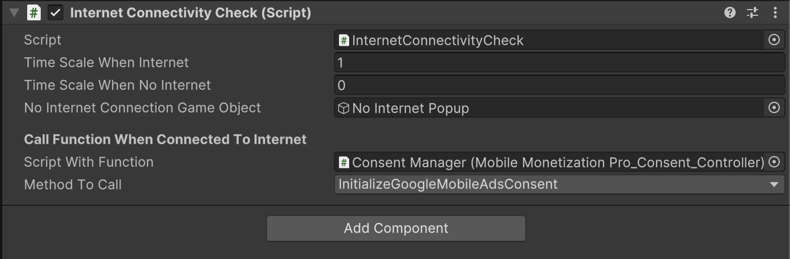

# Internet Connectivity Check

    <iframe width="700" height="405" src="https://www.youtube.com/embed/E7Gt52nQ_tY" title="YouTube video player" frameborder="0" allow="accelerometer; autoplay; clipboard-write; encrypted-media; gyroscope; picture-in-picture; web-share" referrerpolicy="strict-origin-when-cross-origin" allowfullscreen></iframe>

## Introduction

In this video, you'll learn how to integrate **Rate Game Popup** into your Unity mobile game. We will cover the following key concepts:

- Setting up a No internet connectivity checker script for a game, which alerts players when they lose internet connection.

- When the player is disconnected, a message indicating no internet connection is displayed.

- Once the player reconnects to the internet, a custom function can be triggered to reinitialize the SDK and reload ads in the game.

### Creating the No Internet Connectivity Popup

- To implement the no internet connectivity checker, an empty game object is created and named accordingly.
- The transform of this game object is reset, and a component called 'internet connectivity check' is added to perform the connectivity checks.

### Displaying the No Internet Popup

- A no internet connection popup is created within the canvas and is activated when the player loses internet connectivity.
- This popup is initially set to be deactivated and is linked to the game object to display the appropriate message when needed.
- The functionality includes defining actions that occur when the player reconnects to the internet, such as re-enabling ads in the game.
- Custom functions can be called by dragging the relevant MonoBehaviour script into the setup and selecting the desired method to invoke.

### Building and Testing the Game

- After setting up the connectivity checker script.
- Build and run on an Android device, where it is confirmed that no ads are displayed when there is no internet connection.
- Upon connecting to Wi-Fi, the game successfully displays ads, demonstrating that the reinitialization works as intended.

### Internet Connectivity Check

<table class="custom-table">
<tr>
<th>Fields</th>
<th>Info</th>
</tr>

<tr>
<td>TimeScaleWhenInternet</td>
<td>Time scale when the internet connection is active (1 = normal speed).</td>
</tr>

<tr>
<td><b>TimeScaleWhenNoInternet</b></td>
<td>Time scale when there is no internet connection (0 = paused).</td>
</tr>

<tr>
<td>NoInternetConnectionGameObject</td>
<td>The GameObject to display when there is no internet connection.</td>
</tr>

<tr>
<td>scriptWithFunction</td>
<td>The MonoBehaviour script that contains the method to invoke when internet is restored.</td>
</tr>

<tr>
<td>methodName</td>
<td>The name of the method to invoke from the scriptWithFunction when internet is restored.</td>
</tr>

</table>

