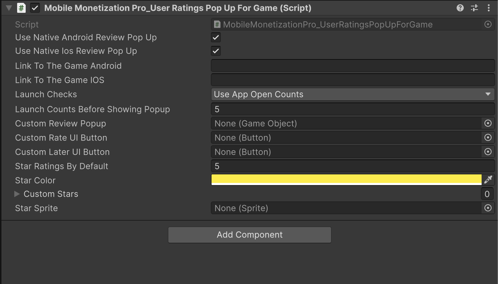

# Rate Game Popup

    <iframe width="700" height="405" src="https://www.youtube.com/embed/HSeF-VG10NI" title="YouTube video player" frameborder="0" allow="accelerometer; autoplay; clipboard-write; encrypted-media; gyroscope; picture-in-picture; web-share" referrerpolicy="strict-origin-when-cross-origin" allowfullscreen></iframe>

## Introduction

In this video, you'll learn how to integrate **Rate Game Popup** into your Unity mobile game. We will cover the following key concepts:

- **Native Android Rate Game Popup**: Learn how to create and display a native Android rate popup directly within your game.

- **iOS Native Rate Game Popup**: Follow a step-by-step guide to setting up a native iOS rate popup in your Unity project.

- **Custom Rate Game Popup Formats**: Option for customizable popup and how to implement.

- **Testing on Android and iOS**: See how to test the Rate Game Popup on real Android and iOS devices to ensure everything works perfectly.

### User Rate Game Popup

<table class="custom-table">
<tr>
<th>Fields</th>
<th>Info</th>
</tr>

<tr>
<td>UseNativeAndroidReviewPopUp</td>
<td>Determines whether to use the native Android review popup for rating.</td>
</tr>

<tr>
<td>UseNativeIosReviewPopUp</td>
<td>Determines whether to use the native iOS review popup for rating.</td>
</tr>

<tr>
<td>LinkToTheGameAndroid</td>
<td>Link to the game on the Android store for users to open.</td>
</tr>

<tr>
<td>LinkToTheGameIOS</td>
<td>Link to the game on the iOS App Store for users to open.</td>
</tr>

<tr>
<td>Options</td>
<td>Determines the launch condition for showing the review popup:
<ul>
<li>UseAppOpenCounts — Use the app open counts to determine when to show the review popup.</li>
<li>UseSessionCounts — Use session counts to determine when to show the review popup.</li>
</ul>
</td>
</tr>

<tr>
<td>LaunchCountsBeforeShowingPopup</td>
<td>Number of times the game should be opened before showing the review popup.</td>
</tr>

<tr>
<td>CustomReviewPopup</td>
<td>Custom review popup UI GameObject.</td>
</tr>

<tr>
<td>CustomRateUIButton</td>
<td>Custom button to rate the game.</td>
</tr>

<tr>
<td>CustomLaterUIButton</td>
<td>Custom button to dismiss the review prompt.</td>
</tr>

<tr>
<td>StarRatingsByDefault</td>
<td>Default star rating value to be displayed.</td>
</tr>

<tr>
<td>StarColor</td>
<td>Color used to change the star ratings.</td>
</tr>

<tr>
<td>CustomStars</td>
<td>Array of custom star GameObjects to show the rating system.</td>
</tr>

<tr>
<td>StarSprite</td>
<td>Sprite to be activated when a star is clicked.</td>
</tr>

</table>
