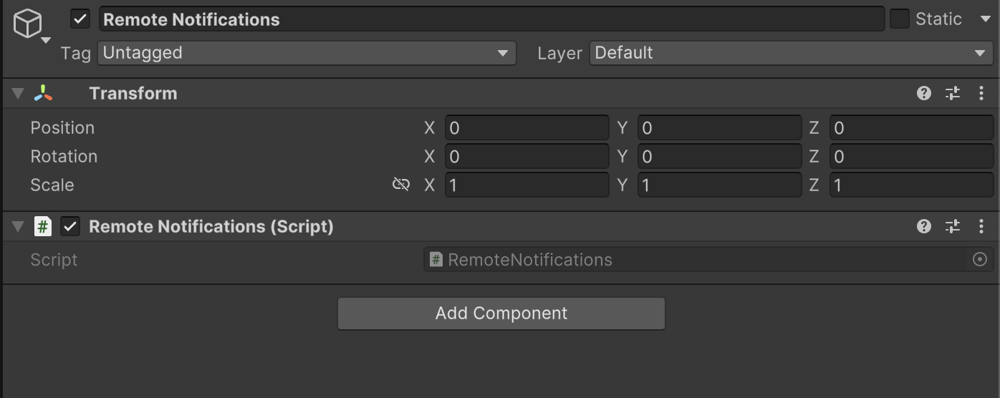

# Remote Notifications

    <iframe width="700" height="405" src="https://www.youtube.com/embed/usnKGrXNhcc" title="YouTube video player" frameborder="0" allow="accelerometer; autoplay; clipboard-write; encrypted-media; gyroscope; picture-in-picture; web-share" referrerpolicy="strict-origin-when-cross-origin" allowfullscreen></iframe>

## Introduction

The tutorial focuses on adding an **Remote Notifications** using Firebase for both Android and iOS devices.It is essential to ensure that the platform is set to iOS before proceeding with the integration steps.

### Creating a Firebase Project

- The first step involves visiting the Firebase console at console.firebase.google.com to create a new Firebase project.
- Users are instructed to click on the 'Create a Firebase project' button and provide a project name, such as 'test game 2'.
- After naming the project, users should click 'Continue' and select their Google Analytics account before finalizing the project creation.

### Registering Apps in Firebase

- Once the Firebase project is created, users need to register their apps, starting with Unity for both Android and iOS.
- For iOS, users must copy the bundle ID from the App Store Connect and from Google Play for Android.
- After registering both apps, users download the required configuration files: Google services.json for Android and Google service info.plist for iOS.

### Importing Configuration Files into Unity

- Users are guided to open their Unity project and import the downloaded configuration files by dragging and dropping them into the assets root folder.
- Once the files are imported, users proceed to download the Firebase Unity SDK from Firebase and import the Firebase messaging package into Unity.

### Setting Up Firebase Messaging in Unity

- After importing the Firebase messaging package, users must resolve any dependencies through the External Dependency Manager < Android Resolver < Resolve.
- After this create an empty game object named 'Remote Notifications' and add the necessary scripts for remote notifications [as mentioned in the video above].
- Users are instructed to drag and drop the remote notification script into the project, completing the Unity setup for Firebase messaging.

### Configuring Firebase Project Settings

- Users navigate back to the Firebase console to access the project settings for both Android and iOS apps, ensuring that the correct package name and app ID are displayed.
- For iOS, users must provide their Team ID and App Store ID, which can be retrieved from the App Store Connect.
- Once all information is filled in, users save the settings and proceed to configure cloud messaging for iOS by uploading the APN authentication key.

### Creating the APN Authentication Key

- To create the APN authentication key, users visit the Apple Developer website and generate a new key, ensuring to check the Apple Push Notification Services checkbox.
- After configuring the key settings, users download the key and upload it to Firebase, along with the Key ID, completing the setup for remote notifications.
- The setup is confirmed as complete, and users can now proceed to test the notifications.

### Remote Notifications Script

