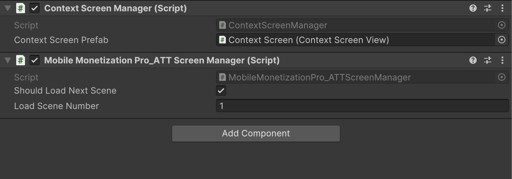

# App Tracking Transparency Setup

    <iframe width="700" height="405" src="https://www.youtube.com/embed/wIk53UA6SYE" title="YouTube video player" frameborder="0" allow="accelerometer; autoplay; clipboard-write; encrypted-media; gyroscope; picture-in-picture; web-share" referrerpolicy="strict-origin-when-cross-origin" allowfullscreen></iframe>

## Introduction

The tutorial focuses on adding an **App Tracking Transparency (ATT) popup** for iOS applications.It is essential to ensure that the platform is set to iOS before proceeding with the integration steps.

### Setting Up the Environment

- Users are instructed to navigate to the Tools section and select Mobile Monetization Pro and Integration Tool.
- The integration option for the ATT popup is selected, followed by downloading the necessary package from the Unity registry.
- It is necessary to search for and install the iOS 14 advertising support package from package manager.

### Importing Required Assets

- After installation, users need to access the samples and import the context screen.

### Displaying the ATT Popup

- The first method to display the ATT popup involves showing it in the separate scene, specifically scene number zero.
- Users are guided to copy specific elements from the context screen sample and paste them into the Mobile Monetization Pro demo game scene.
- When the game starts, the ATT popup will appear, prompting the user to make a choice regarding tracking.

### Building and Testing the Application

- To test the implementation, a build for the iOS device must be created by navigating to the file build settings.
- Once the project is built, users should open the Unity iPhone XC workspace and connect their iPhone.
- After selecting the appropriate category, the game can be installed on the iOS device for testing.

### User Interaction with the Popup

- Upon launching the game, users will see the ATT prompt asking for permission to track their activity across other apps and websites.
- If the user selects 'allow' and restarts the game, the ATT popup will not reappear, thus confirming the user's choice.

### Alternative Method for Displaying the ATT Popup

- An alternative method involves deleting the context screen sample and utilizing the iOS 14 advertising support context screen.
- Users can then access the Mobile Monetization Pro Tools and drag the ATT screen manager script into the scene.
- It is important to add this scene to the build settings to ensure the ATT popup appears in the first scene of the game.

### Combining ATT and GDPR Popups

- If mobile ads are being used, it may also be necessary to implement a GDPR popup alongside the ATT popup.
- Users can specify that the ATT popup is shown in the first scene, while the GDPR popup can be displayed when the second scene loads.
- To facilitate this, users should check the option to load the next scene and provide the corresponding scene number in the build settings.

### Final Testing and Conclusion

- After configuring the scenes, users can create a build to test the functionality of the popups.
- When the first scene loads, the ATT popup will appear, and upon clicking 'next,' the second scene will load successfully without displaying the ATT popup again.
- The tutorial concludes with the successful implementation of the App Tracking Transparency popup in the game.

