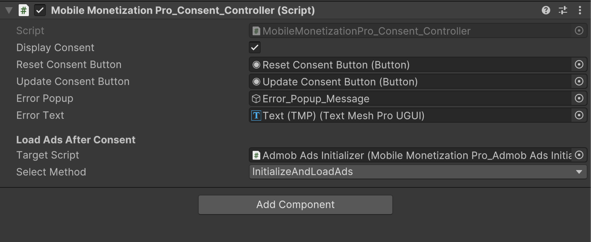

# GDPR Setup

    <iframe width="700" height="405" src="https://www.youtube.com/embed/WISFKnIqCg4" title="YouTube video player" frameborder="0" allow="accelerometer; autoplay; clipboard-write; encrypted-media; gyroscope; picture-in-picture; web-share" referrerpolicy="strict-origin-when-cross-origin" allowfullscreen></iframe>

## Introduction

In this video, you'll learn how to implement **GDPR consent message** in your mobile game using **Mobile Monetization Pro**.

We cover:
- Display a GDPR popup for players in supported regions
- Request consent for personalized and non-personalized ads

### Consent Controller Script 

<table class="custom-table">
<tr>
  <th>Fields</th>
  <th>Info</th>
</tr>
<tr><td>DisplayConsent</td><td>Set to true to display the GDPR consent</td></tr>
<tr><td>ResetConsentButton</td><td>Button to reset consent.</td></tr>
<tr><td>UpdateConsentButton</td><td>Button to show user consent settings again.</td></tr>
<tr><td>ErrorPopup</td><td>GameObject with the error popup.</td></tr>
<tr><td>ErrorText</td><td>Error message for the error popup.</td></tr>
<tr><td>targetScript</td><td>Drag a MonoBehaviour from the scene with public void methods.</td></tr>
<tr><td>selectedMethodName</td><td>Name of the public void method to call.</td></tr>
</table>
