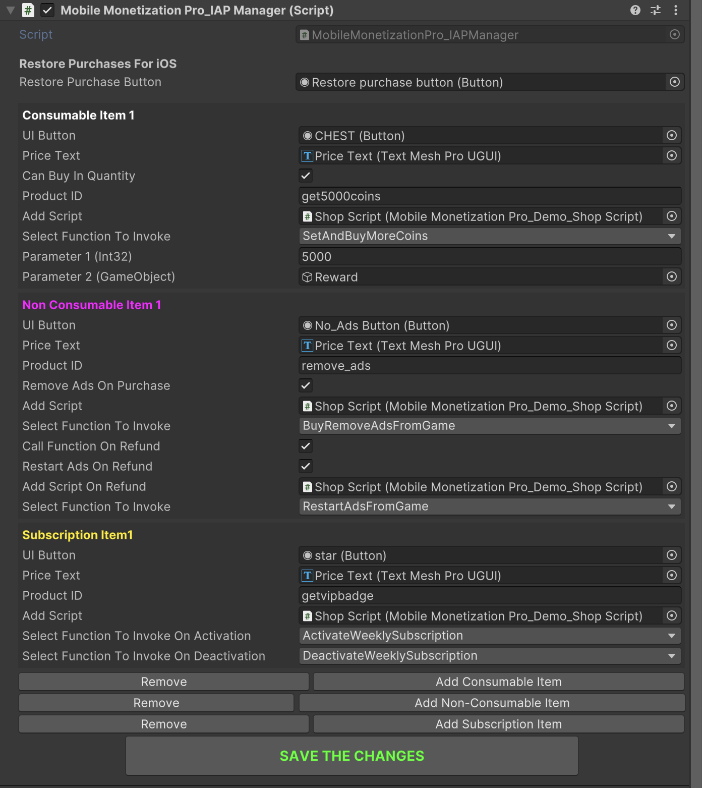

# In App Purchase Setup

    <iframe width="700" height="405" src="https://www.youtube.com/embed/zRkIig4GTH4" title="YouTube video player" frameborder="0" allow="accelerometer; autoplay; clipboard-write; encrypted-media; gyroscope; picture-in-picture; web-share" referrerpolicy="strict-origin-when-cross-origin" allowfullscreen></iframe>

## Introduction

In this video, you'll learn how to implement **In App Purchase** in your mobile game using **Mobile Monetization Pro**.

### IAP Manager Script

<table class="custom-table">
<tr>
  <th>Fields</th>
  <th>Info</th>
</tr>
<tr><td>UIButton</td><td>The button for the consumable item.</td></tr>
<tr><td>PriceText</td><td>Text to display the price of the consumable item.</td></tr>
<tr><td>CanBuyInQuantity</td><td>If true, allows the item to be bought in a specific quantity.</td></tr>
<tr><td>ProductId</td><td>The product ID for the consumable item.</td></tr>
<tr><td>AddScript</td><td>The MonoBehaviour script to be added when the item is bought.</td></tr>
<tr><td>FunctionToInvoke</td><td>The function to invoke when the item is purchased.</td></tr>
<tr><td>FunctionParameters</td><td>A list of parameters to pass to the function when invoking it.</td></tr>
<tr><td>UIButton</td><td>The button for the non-consumable item.</td></tr>
<tr><td>PriceText</td><td>Text to display the price of the non-consumable item.</td></tr>
<tr><td>ProductId</td><td>The product ID for the non-consumable item.</td></tr>
<tr><td>RemoveAdsFromGame</td><td>If true, removes ads from the game when the non-consumable item is purchased.</td></tr>
<tr><td>AddScript</td><td>The MonoBehaviour script to be added when the item is bought.</td></tr>
<tr><td>FunctionToInvoke</td><td>The function to invoke when the item is purchased.</td></tr>
<tr><td>FunctionParameters</td><td>A list of parameters to pass to the function when invoking it.</td></tr>
<tr><td>CallFunctionOnRefund</td><td>If true, invokes the specified function when a refund occurs.</td></tr>
<tr><td>RestartAdsOnRefund</td><td>If true, restarts ads on refund.</td></tr>
<tr><td>AddScriptOnRefund</td><td>The MonoBehaviour script to be added on refund.</td></tr>
<tr><td>FunctionToInvokeOnRefund</td><td>The function to invoke on refund.</td></tr>
<tr><td>FunctionParametersForRefund</td><td>A list of parameters to pass to the function on refund.</td></tr>
<tr><td>UIButton</td><td>The button for the subscription item.</td></tr>
<tr><td>PriceText</td><td>Text to display the price of the subscription.</td></tr>
<tr><td>ProductId</td><td>The product ID for the subscription item.</td></tr>
<tr><td>AddScript</td><td>The MonoBehaviour script to be added when the subscription is purchased.</td></tr>
<tr><td>FunctionToInvokeForActivatingSubscription</td><td>The function to invoke for activating the subscription.</td></tr>
<tr><td>FunctionToInvokeForDeactivatingSubscription</td><td>The function to invoke for deactivating the subscription.</td></tr>
<tr><td>ActivationFunctionParameters</td><td>A list of parameters to pass to the activation function when activating the subscription.</td></tr>
<tr><td>DeactivationFunctionParameters</td><td>A list of parameters to pass to the deactivation function when deactivating the subscription.</td></tr>
</table>
