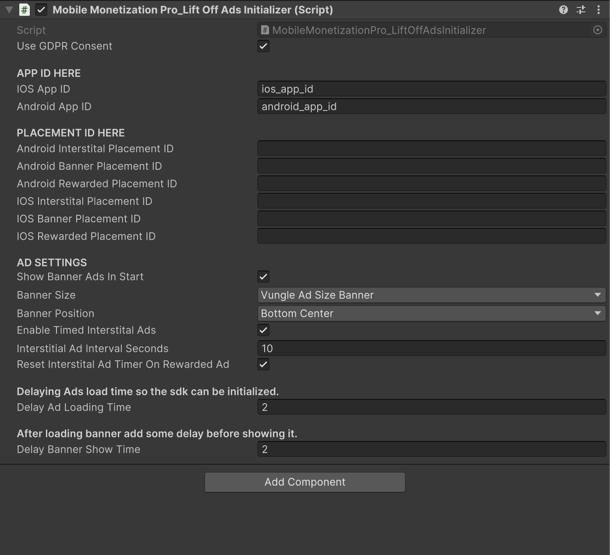
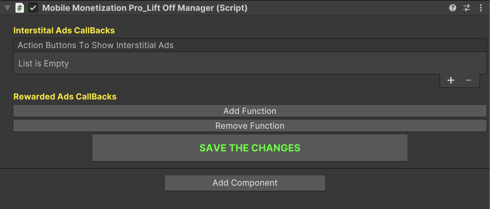

# LiftOff Ads

    <iframe width="700" height="405" src="https://www.youtube.com/embed/6GrBtBXuKI0" title="YouTube video player" frameborder="0" allow="accelerometer; autoplay; clipboard-write; encrypted-media; gyroscope; picture-in-picture; web-share" referrerpolicy="strict-origin-when-cross-origin" allowfullscreen></iframe>

## Introduction

In this video, we take the first step in integrating **LiftOff Ads(Vungle Ads)** into your mobile game using **Mobile Monetization Pro**.

You'll learn how to:

- Set up your LiftOff ads account.

- Configure LiftOff SDK in Unity.

- Integrate and test vunLiftOffgle ads.

### LiftOff Ads Initializer 

<table class="custom-table">
<tr>
<th>Fields</th>
<th>Info</th>
</tr>

<tr>
<td>UseGDPRConsent</td>
<td>Enable or disable GDPR consent prompt before initializing ads.</td>
</tr>

<tr>
<td>IOSAppID</td>
<td>Your iOS App ID provided by LiftOff (Vungle) dashboard.</td>
</tr>

<tr>
<td>AndroidAppID</td>
<td>Your Android App ID provided by LiftOff (Vungle) dashboard.</td>
</tr>

<tr>
<td>AndroidInterstitalPlacementID</td>
<td>Placement ID for Interstitial Ads on Android.</td>
</tr>

<tr>
<td>AndroidBannerPlacementID</td>
<td>Placement ID for Banner Ads on Android.</td>
</tr>

<tr>
<td>AndroidRewardedPlacementID</td>
<td>Placement ID for Rewarded Ads on Android.</td>
</tr>

<tr>
<td>IOSInterstitalPlacementID</td>
<td>Placement ID for Interstitial Ads on iOS.</td>
</tr>

<tr>
<td>IOSBannerPlacementID</td>
<td>Placement ID for Banner Ads on iOS.</td>
</tr>

<tr>
<td>IOSRewardedPlacementID</td>
<td>Placement ID for Rewarded Ads on iOS.</td>
</tr>

<tr>
<td>ShowBannerAdsInStart</td>
<td>Automatically show banner ads when the app starts.</td>
</tr>

<tr>
<td>BannerSize</td>
<td>Select the banner size for your ads.</td>
</tr>

<tr>
<td>BannerPosition</td>
<td>Select the banner position on the screen.</td>
</tr>

<tr>
<td>EnableTimedInterstitalAds</td>
<td>Enable automatic timed Interstitial ads after certain intervals.</td>
</tr>

<tr>
<td>InterstitialAdIntervalSeconds</td>
<td>Time interval (in seconds) between each Interstitial ad.</td>
</tr>

<tr>
<td>ResetInterstitalAdTimerOnRewardedAd</td>
<td>Reset Interstitial ad timer when a Rewarded ad is watched.</td>
</tr>

<tr>
<td>DelayAdLoadingTime</td>
<td>Delay time (in seconds) before loading ads after initialization.</td>
</tr>

<tr>
<td>DelayBannerShowTime</td>
<td>Delay time (in seconds) after loading a banner ad before showing it.</td>
</tr>

</table>

### LiftOff Ads Manager 

<table class="custom-table">
<tr>
<th>Fields</th>
<th>Info</th>
</tr>

<tr>
<td>ShowBannerAdButton</td>
<td>Button that, when clicked, manually shows the banner ad.</td>
</tr>

<tr>
<td>RewardedButton</td>
<td>Button that triggers a rewarded ad and invokes a linked function after the ad is completed.</td>
</tr>

<tr>
<td>script</td>
<td>Script containing the function to invoke after the rewarded ad is completed.</td>
</tr>

<tr>
<td>scriptName</td>
<td>Name of the script associated with this function info (for reference).</td>
</tr>

<tr>
<td>functionNames</td>
<td>List of function names available in the assigned script.</td>
</tr>

<tr>
<td>selectedFunctionIndex</td>
<td>Index of the selected function from the available functions list.</td>
</tr>

<tr>
<td>ActionButtonsToInvokeInterstitalAds</td>
<td>Buttons that trigger interstitial ads when clicked.</td>
</tr>

<tr>
<td>rewardedButtons</td>
<td>List of rewarded buttons collected for setting up listeners.</td>
</tr>

<tr>
<td>functions</td>
<td>List storing reward button configurations and their corresponding function call information.</td>
</tr>

</table>
